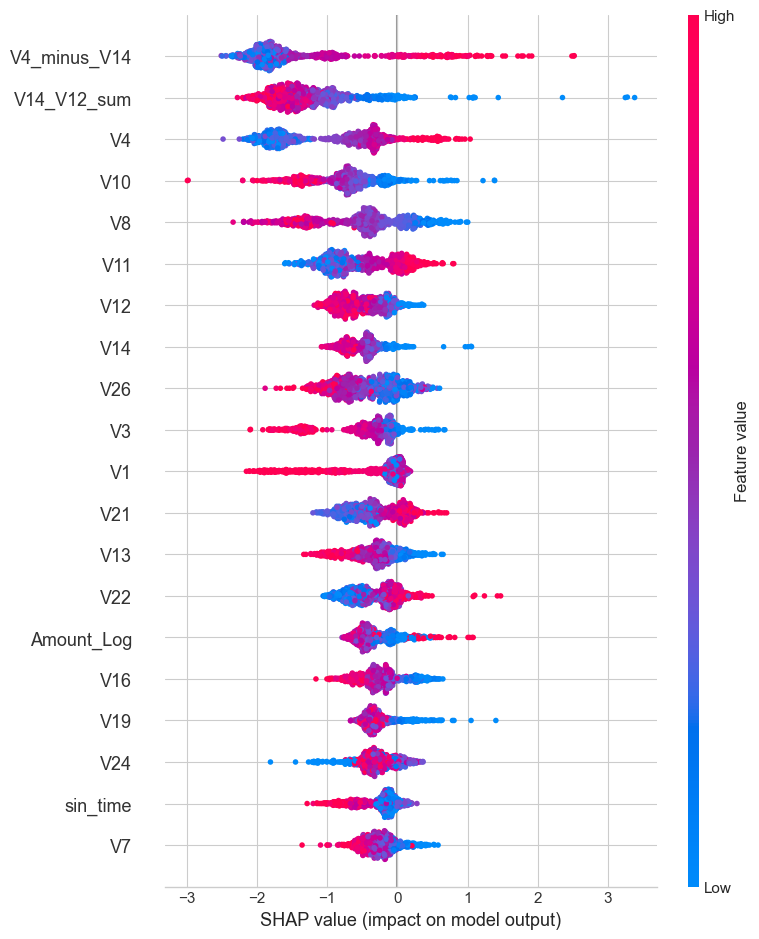
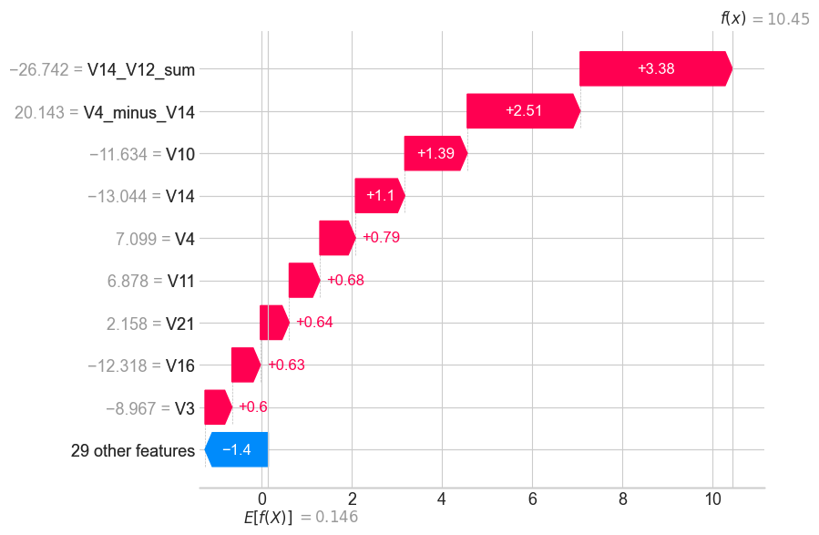
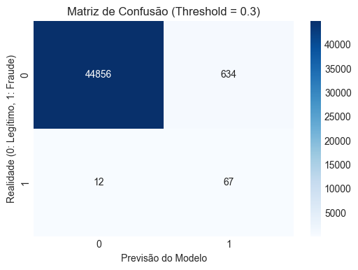

#  Detecção de Fraudes em Cartões de Crédito: Uma Abordagem Robusta com Stacking Ensembles e XAI

**Autor:** Willian Rupert (Estudante de Ciência da Computação - CIn/UFPE)  
**Objetivo:** Desenvolvimento de um modelo de *Machine Learning* de alta precisão para o desafio de classificação de transações financeiras fraudulentas, priorizando o rigor metodológico, otimização Bayesiana, a reprodutibilidade e a explicabilidade voltada para o negócio.

---

##  1. O Problema e a Visão de Negócio (Adequação da Métrica)

Em sistemas de pagamentos reais, lidamos com um cenário de **extremo desbalanceamento de classes**, onde as fraudes representam uma fração minúscula das transações diárias. 

Ao analisar o histórico de avaliações de modelos preditivos em cenários críticos, observei que muitos profissionais focam cegamente no F1-Score ou na Acurácia. A minha modelagem, contudo, foi construída com foco no impacto de negócio: **a prioridade financeira é o Recall (Sensibilidade)**. 

Aprovar uma fraude (Falso Negativo) tem um custo de estorno devastador. Assim, a arquitetura foi desenhada para maximizar a captura de fraudes reais, ajustando o limiar de decisão (*threshold* de `0.3`) para manter os Falsos Positivos em um volume operacionalmente aceitável para as equipes de análise manual.

---

##  2. Rigor Metodológico e Prevenção de Data Leakage

Para garantir que a performance não fosse fruto de memorização, adotei uma política inegociável de segregação:
* **Hold-out Validation (80/20):** Separei 20% dos dados como um conjunto cego. Todas as decisões de arquitetura e geração de métricas foram tomadas baseadas **apenas** nos 80% do treino.
* **Isolamento de Transformadores:** O algoritmo de padronização (`RobustScaler`) foi ajustado (`.fit()`) unicamente nos dados de treino. Os parâmetros de escala aprendidos foram então aplicados de forma estática (`.transform()`) aos dados de teste.

---

##  3. A Evolução da Arquitetura (A Rota do 0.99090)

O desenvolvimento deste modelo foi um processo científico e iterativo, registrado ao longo de 7 submissões na plataforma Kaggle.

### Fase 1: Rotação Geométrica (Feature Engineering)
As árvores de decisão sofrem limitações ao lidar com fronteiras de classe diagonais, pois só realizam particionamentos ortogonais. Para contornar isso, criei variáveis que efetuam uma projeção matemática do espaço:
1. **Interações Otimizadas:** A diferença algébrica `V4 - V14` e a soma `V14 + V12` rotacionaram o plano, permitindo que as árvores isolassem a fraude com precisão cirúrgica sem precisarem gerar ramificações profundas (evitando *overfitting*).
2. **Tempo e Logaritmo:** `Time` foi decomposto em ondas (seno/cosseno) para capturar a sazonalidade, e `Amount` recebeu transformação logarítmica.

### Fase 2: Otimização Bayesiana (Optuna)
Em vez de depender de chutes manuais, integrei o \textit{framework} **Optuna**. O algoritmo utilizou estimadores de Parzen estruturados em árvore para varrer o hiper-espaço e encontrar as engrenagens perfeitas do modelo (como o `learning_rate=0.09` para o XGBoost).

### Fase 3: Stacking Ensemble Calibrado e o Public Leaderboard
A arquitetura final é composta por:
* **Nível 0:** XGBoost, LightGBM e CatBoost otimizados e penalizando severamente a classe majoritária.
* **Nível 1 (O Juiz):** Uma Regressão Logística operando com `class_weight='balanced'`. O meta-modelo recebe as probabilidades brutas das árvores e as calibra linearmente.

**A Decisão sobre o Conjunto de Treino:** Durante a competição, testei re-treinar a rede com 100% dos dados para forçar o *score*. Contudo, essa prática gerou flutuações e perda de estabilidade ($\approx 0.985$). Tomei a decisão arquitetural consciente de **submeter a versão treinada estritamente no conjunto de 80%**. O Kaggle avalia publicamente apenas 30% dos dados. Submeter o modelo estabilizado na validação local é a prova máxima de maturidade para evitar o catastrófico *overfitting* da métrica pública e garantir o sucesso na avaliação privada (70% ocultos). Com esta disciplina, **cravei o pico absoluto de 0.99090**.

---

##  4. Explicabilidade e Tradução para o Negócio (XAI)

Modelos "caixa-preta" são vetados em ambientes regulados. A arquitetura foi desmistificada utilizando a biblioteca **SHAP (SHapley Additive exPlanations)**.

* **Visão Macro (Global):** Os gráficos comprovam a eficácia da nossa engenharia. As interações criadas (`V4_minus_V14`) brilham de forma unânime como os fatores mais determinantes do modelo.

  

 

* **Visão Micro (Local - Auditoria):** O *Waterfall* detalha a anatomia de uma fraude interceptada. Conseguimos explicar ao negócio exatamente os "pesos e pontuações" somados pela IA em tempo real para bloquear um cartão.

  

 

* **Impacto Operacional (Matriz de Confusão):** O modelo é equilibrado. Restringe rigorosamente as anomalias, mas aprova tranquilamente as transações saudáveis, limitando os Falsos Positivos a uma ínfima taxa de $\approx 0.77\%$.

  

---

##  5. Qualidade de Engenharia e Reprodutibilidade

A base de código foi estruturada pensando em um *deploy* corporativo e não apenas na competição:
* **`src/preprocessing.py`:** Encapsula, de forma estanque, todas as regras de normalização e transformações algébricas, desenhado para receber novas linhas de dados no futuro.
* **`src/model.py`:** O construtor do *Stacking Ensemble*, facilitando iterações, substituições e auditoria dos estimadores base.
* **`notebooks/main.ipynb`:** O orquestrador limpo e linear que narra o fluxo da execução de ponta a ponta.

---

## 🏁 6. Conclusão

Este repositório mostra que a a robustez em *Machine Learning* reside na inteligência matemática aplicada aos dados e na disciplina metodológica. O modelo resultante atinge uma precisão ímpar (ROC-AUC de 0.99090), é auditável, robusto contra flutuações e perfeitamente dimensionado para salvar uma operação financeira real das perdas diárias por estorno.
